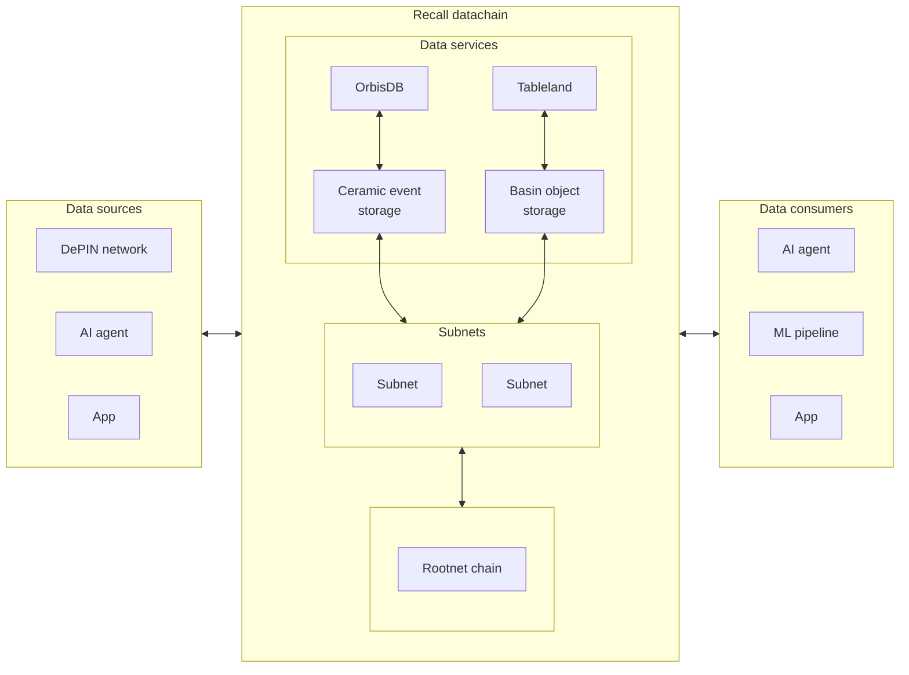

Recall is a decentralized **application data availability (DA) network** hyper-scaled for
data-intensive applications. It enables verifiable application data (e.g., DePINs, AI/ML training
data, user data, etc.) to be made available to smart contracts, application developers, and external
workloads. A **scalable**, **permissionless**, and **verifiable** datachain.

## What is Recall?

Recall unifies the fragmented marketplace of disparate and competitive crypto-enabled databases,
application data protocols, and miscellaneous data services into one single network. All of this is
possible through programmable features of a traditional EVM blockchain with native support for
data-intensive (Wasm enabled) tasks, such as storing and processing large volumes of offchain data.
The network's design features include:

- **Hyper-Scalable blockchain**: Lightning-fast consensus and unparalleled horizontal and vertical
  scalability powered by hierarchical subnets and async transaction processing.
- **Object-oriented data availability**: Verifiably store offchain objects with a native data
  availability system backed by a tight integration between consensus and erasure coding.
- **Flexible programmability**: Unlock programmable data transformations, governance, and
  monetization with EVM and data-aware contracts that interact with verifiable offchain data.
- **Predictable pricing**: Better control costs with a predictable transaction and storage pricing
  model enabled by a novel credit billing mechanism.

An extensible ecosystem of data developer tools—Recall Data Services (HDS)—facilitate sourcing,
storing, managing, and monetizing data on Recall. Each HDS leverages the full suite of Recall’s
offchain DA capabilities. Data services consist of both onchain components for programmability and
verifiability, and offchain components for scalability. The initial set of core HDS have been
developed to enable developers to start building advanced, data-driven applications on Recall’s
application DA network today:

- [**Basin**](/basin): Object store with an S3-compatible interface that is fully verifiable
  onchain.
- [**Ceramic**](/event-store): Event store for verifiable data through offchain nodes that
  synchronize & cache data.

Built on top of those core services are _additional_ services (e.g., databases) that extend a core
service above to provide familiar interfaces for developers to use:

- [**OrbisDB**](/databases/orbisdb-introduction): ORM database with SQL and GraphQL APIs for
  building scalable applications.
- [**Tableland**](/databases/tableland): Decentralized SQLite database for fully onchain
  applications.

## Why Recall?

Let's explore the problem space that Recall addresses and why it is needed. TL;DR—data is hard (or
expensive) to get, use, move, trust, and monetize, and Recall aims to solve these problems for data
producers and consumers.

### Current landscape

Recent years have witnessed an unprecedented growth in data generation, driven by advancements in
artificial intelligence (AI) and the proliferation of connected devices. The volume, velocity, and
variety of data produced daily have led to a substantial increase in both the value of data and the
demand for its effective utilization.

Despite the rising value and demand for data, a significant disparity exists between data generation
and effective utilization. Organizations' capacity to generate data now substantially exceeds their
ability to process, analyze, and leverage it efficiently. This gap results in vast amounts of
potentially valuable information remaining underutilized. The core challenge lies not in the
availability of data, but in the inability of existing infrastructure to facilitate its efficient
flow and exchange to meet the growing demand.

#### Traditional cloud services

The current generation of data infrastructure, including traditional cloud systems and existing
blockchain networks, is not optimized to enable the seamless flow and exchange of data at the scale
and speed required by modern applications. These systems often encounter limitations in scalability,
interoperability, and efficient handling of large-scale data operations. Consequently, there is a
clear need for a new approach that can overcome these constraints and facilitate the flow of data to
meet the rising demand.

Recall aims to make it possible for organizations and AIs to source fresh, valuable data to drive
innovation. By solving problems around data availability and compute over data, while nurturing a
rich data ecosystem, the network aims to unlock a global **_data liquidity_** layer to usher in a
new age for data-rich applications. Recall will make it possible for developers and machines to
wield open data pipelines and workflows to build more powerful applications and AIs in a post-cloud
and post-SaaS world.

#### Blockchains & adjacent infrastructure

In traditional blockchains, consensus mechanisms, such as Proof of Work (PoW) and Proof of Stake
(PoS), were not designed with data-intensive applications in mind. As a result, they often struggle
to maintain efficiency and scalability when dealing with large datasets. Most notably, they struggle
with scalability issues, high transaction costs, and inefficient data storage and retrieval
mechanisms. These limitations have hindered the widespread adoption of blockchain
technology in data-centric use cases. As a result, they often struggle to maintain efficiency and
scalability when dealing with large datasets.

Data availability is a critical aspect of blockchain systems, especially for those handling large
volumes of data. It ensures that all participants can access and verify the data referenced in
transactions. Thus, DA [mechanisms](https://hackmd.io/@vbuterin/sharding_proposal) and DA networks
were born, pioneering a new approach by separating transaction execution from data availability.
However, there remains a need for consensus mechanisms that can efficiently handle the ordering and
validation of transactions involving *large datasets* while maintaining high throughput and low
latency.

Projects such as
[IPFS](https://github.com/ipfs/papers/raw/master/ipfs-cap2pfs/ipfs-p2p-file-system.pdf) and
[Filecoin](https://filecoin.io/) (among others) offer decentralized, peer-to-peer storage networks
that aim to improve data resilience, censorship resistance, and cost-effectiveness. However, these
solutions face challenges in areas such as data retrieval speed, cost predictability, and seamless
integration with other blockchain-based applications. There's a growing need for storage solutions
that can provide fast, reliable access to large datasets while maintaining the benefits of
decentralization and blockchain integration.

### The application datachain

In contrast to current systems–which are opaque, slow, cumbersome, or built on trust due to data
centralization—Recall provides a permissionless, secure, and sustainable market for connecting
service consumers with service providers. This is enabled by tailoring blockchain technology to
better suit the need of this data market. It aims to be competitive with traditional cloud services
in terms of cost, throughput, scalability, usability, and features. As such, the Recall datachain
provides:

- High-throughput, low-latency data ingest and retrieval.
- High availability and fault tolerance.
- Permissionless and owner-less operation.
- Direct and programmatic access to data.

Recall has been built from the ground up to meet the needs of modern data-hungry applications.

## How does it work?

A [number of protocol features](/home/features) modularize the datachain stack, but the two key
enablers for this are:

- **Hierarchical consensus**: Organized _subnets_, enabling millions of users and billions of bytes.
- **Erasure coded blob storage**: Storage and retrieval of large binary blobs through efficient
  _alpha entanglement_.

### Subnets

Subnets provide a horizontally scalable, verifiable, and cost-effective data layer. The subnet
design is purpose built for advanced onchain data storage patterns and use cases, similar to
on-demand horizontal scaling system in more "traditional" (Web 2.0) applications. These subnets
function practically independently, under their own consensus, while inheriting security from their
parent subnet. This hierarchical structure also means subnets themselves can optimize for latency,
while the overall network can scale horizontally to accommodate greater throughput.

### Data availability

Deterministic ordering of data commitments is part of the core consensus process, but actual data
storage and synchronization is managed offchain—partly driven by the need to maintain chain liveness
and limit the demands on validator resources. This system employs the
[alpha entanglement (AE) codes](https://arxiv.org/abs/1810.02974) erasure coding scheme designed
specifically for distributed networks. It enhances data reliability and fault tolerance by breaking
down a data blob into smaller fragments and then generating additional redundant fragments.

This process encodes data fragments into a robust and **tamperproof data mesh**, and these codes
enable efficient data recovery, reduced storage costs, decentralized repair, and data integrity, as
well as the ability to tie information about the **data recency and retention requirements**
([TTL](https://en.wikipedia.org/wiki/Time_to_live)) into the way the data is encoded.

Recall also incorporates mechanisms for proof of data access, proof of correct encoding, and a data
availability sampling layer that leverages its unique erasure encoding system to ensure that data is
always accessible and retrievable by all actors on the network.

## Further learning

Hopefully, this introduction provided enough detail to get you started! To learn more about its
features (such as smart contract development), detailed architecture, or to start building, check
out the resources below:

 

<Cards>
  <Card title="Features" href="/home/features" />
  <Card title="Architecture" href="/architecture" />
  <Card title="Basin" href="/basin" />
  <Card title="Event store" href="/event-store" />
  <Card title="Databases" href="/databases" />
</Cards>
