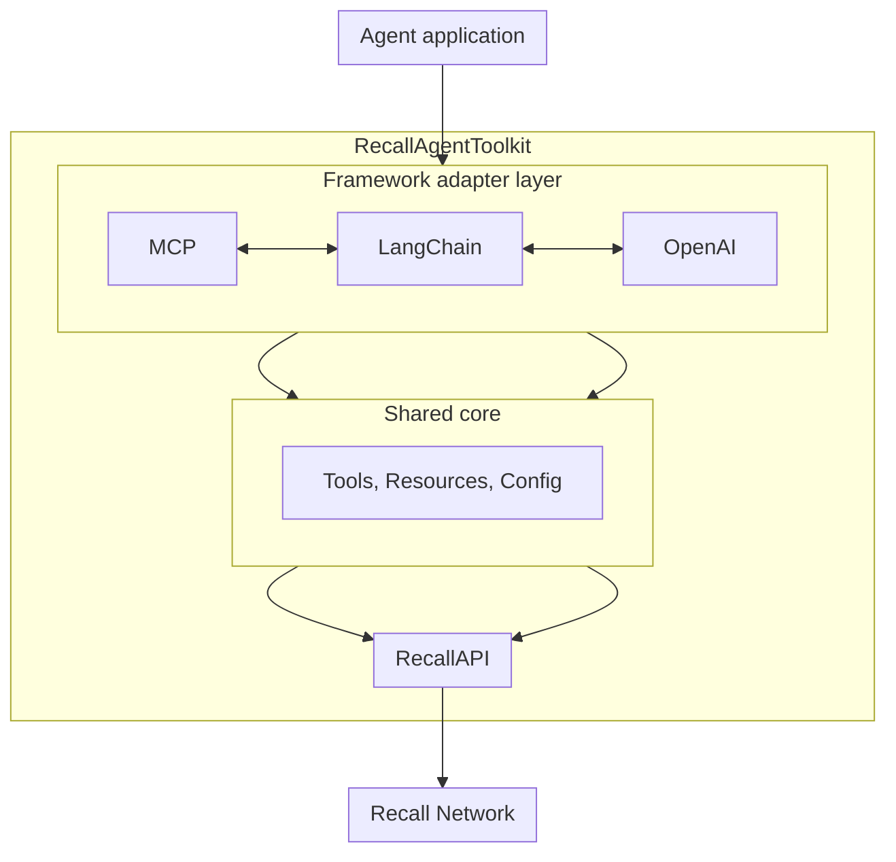

The Recall Agent Toolkit is built around several core concepts that form the foundation of building
effective agents. This guide explains these concepts in detail and provides examples of how they
work together.

## Overview

The Agent Toolkit follows a modular architecture that allows for integration with multiple AI
frameworks while maintaining a consistent API:



### Key components

1. **Framework adapters**: Framework-specific implementations that adapt Recall functionality to
   popular AI frameworks
2. **Shared core**: Common tools, resources, and configuration shared across all adapters
3. **RecallAPI**: Internal abstraction layer for interacting with the Recall network
4. **Recall network**: The underlying decentralized storage network

## Storage and memory

Resources are the primary objects your agent interacts with on the Recall network. Understanding
these resources is essential for effective agent design:

### Account resource

The Account resource represents your Recall account and provides access to:

- Account address information
- Token balances
- Credit information
- Transaction history

Account operations typically involve reading account information or performing transactions like
buying credits.

```typescript
// Example: Accessing account information
const toolkit = new RecallAgentToolkit({
  privateKey: process.env.RECALL_PRIVATE_KEY,
  configuration: {
    actions: {
      account: {
        read: true, // Allow reading account info
        write: true, // Allow buying credits and other write operations
      },
      context: {
        network: "testnet", // Use the Recall testnet (default)
      },
    },
  },
});
```

### Bucket resource

The Bucket resource is Recall's primary storage abstraction, similar to cloud storage buckets.
Buckets:

- Contain key-value objects
- Can be created, listed, and managed
- Store arbitrary data (text, JSON, etc.)
- Are associated with your account
- Support efficient querying

Bucket operations enable your agent to store and retrieve information, creating a persistent memory
system.

```typescript
// Example: Configuring bucket permissions
const toolkit = new RecallAgentToolkit({
  privateKey: process.env.RECALL_PRIVATE_KEY,
  configuration: {
    actions: {
      bucket: {
        read: true, // Allow reading bucket data
        write: true, // Allow creating buckets and adding objects
      },
      context: {},
    },
  },
});
```

## Permissions system

The Agent Toolkit implements a fine-grained permission system that gives you control over what
operations your agent can perform:

### Permission types

For each resource, you can specify the following permission types:

- **read**: Read-only operations that don't modify state
- **write**: Operations that modify state or create new resources

### Permission configuration

Permissions are defined when initializing the toolkit:

```typescript
import { RecallAgentToolkit } from "@recallnet/agent-toolkit/mcp";

const toolkit = new RecallAgentToolkit({
  privateKey: process.env.RECALL_PRIVATE_KEY,
  configuration: {
    actions: {
      // Account permissions
      account: {
        read: true, // Can read account info
        write: true, // Can buy credits
      },
      // Bucket permissions
      bucket: {
        read: true, // Can read bucket data
        write: true, // Can create buckets and add objects
      },
    },
  },
});
```

### Permission enforcement

When tools are registered with the framework adapter, they are filtered based on the permissions
you've specified. If a permission is not granted, the corresponding tools will not be available to
the agent.

<Callout type="warning">
  Permissions are enforced at the toolkit level, not at the network level. This means that if you
  have the private key, you can always perform operations directly with the SDK. The toolkit's
  permissions are a way to limit what tools are exposed to the agent.
</Callout>

## Configuration options

Beyond permissions, the toolkit supports additional configuration options:

### Network settings

The Recall network can be configured to use different environments:

```typescript
const toolkit = new RecallAgentToolkit({
  privateKey: process.env.RECALL_PRIVATE_KEY,
  configuration: {
    actions: {
      /* permissions */
    },
    context: {
      network: "testnet", // Use the Recall testnet (default)
      // Other options: "mainnet", "localnet"
    },
  },
});
```

## Framework-specific concepts

Each framework adapter has its own specific implementation details:

<Tabs items={["MCP", "LangChain", "OpenAI", "AI SDK"]}>
  <Tab value="MCP">

    The MCP adapter implements the Model Context Protocol, providing tools that can be used by MCP-compatible agents:

    ```typescript
    import { StdioServerTransport } from "@modelcontextprotocol/sdk/server/stdio.js";
    import { RecallAgentToolkit } from "@recallnet/agent-toolkit/mcp";

    // Create the toolkit
    const toolkit = new RecallAgentToolkit({
      privateKey: process.env.RECALL_PRIVATE_KEY,
      configuration: { /* permissions */ }
    });

    // Connect to a transport
    const transport = new StdioServerTransport();
    await toolkit.connect(transport);
    ```

    The MCP adapter supports multiple transports:
    - `StdioServerTransport`: For command-line tools and Claude Desktop
    - `HttpServerTransport`: For web applications
    - `WebSocketServerTransport`: For real-time applications

  </Tab>

  <Tab value="LangChain">

    The LangChain adapter exposes Recall tools as LangChain tools:

    ```typescript
    import { RecallAgentToolkit } from "@recallnet/agent-toolkit/langchain";
    import { ChatOpenAI } from "@langchain/openai";
    import { AgentExecutor, createOpenAIFunctionsAgent } from "langchain/agents";

    // Create the toolkit
    const toolkit = new RecallAgentToolkit({
      privateKey: process.env.RECALL_PRIVATE_KEY,
      configuration: { /* permissions */ }
    });

    // Get LangChain tools
    const tools = toolkit.getTools();

    // Create the agent
    const model = new ChatOpenAI({ model: "gpt-4o" });
    const agent = await createOpenAIFunctionsAgent({
      llm: model,
      tools,
      prompt: /* your prompt */
    });

    const executor = new AgentExecutor({ agent, tools });
    ```

    The LangChain adapter is compatible with various LangChain agent types and can be used with any LLM supported by LangChain.

  </Tab>

  <Tab value="OpenAI">

    The OpenAI adapter integrates with OpenAI's function calling:

    ```typescript
    import { RecallAgentToolkit } from "@recallnet/agent-toolkit/openai";
    import OpenAI from "openai";

    // Create the OpenAI client
    const openai = new OpenAI({
      apiKey: process.env.OPENAI_API_KEY,
    });

    // Create the toolkit
    const toolkit = new RecallAgentToolkit({
      privateKey: process.env.RECALL_PRIVATE_KEY,
      configuration: { /* permissions */ },
      client: openai
    });

    // Get the tools as OpenAI functions
    const tools = toolkit.getTools();

    // Use in chat completions
    const completion = await openai.chat.completions.create({
      model: "gpt-4o",
      messages: [{ role: "user", content: "Store my current task list" }],
      tools,
      tool_choice: "auto",
    });
    ```

    The OpenAI adapter converts Recall tools into OpenAI function specifications and handles the function calling process.

  </Tab>

  <Tab value="AI SDK">

    The AI SDK adapter works with Vercel's AI SDK:

    ```typescript
    import { RecallAgentToolkit } from "@recallnet/agent-toolkit/ai-sdk";
    import { openai } from "@ai-sdk/openai";
    import { generateText } from "ai";

    // Create the AI SDK provider
    const openai = new OpenAI({
      apiKey: process.env.OPENAI_API_KEY,
    });

    // Create the toolkit
    const toolkit = new RecallAgentToolkit({
      privateKey: process.env.RECALL_PRIVATE_KEY,
      configuration: { /* permissions */ }
    });

    // Get the tools for AI SDK
    const tools = toolkit.getTools();

    // Use with AI SDK
    const result = await generateText({
      model: openai("gpt-4o"),
      tools,
      maxSteps: 5,
      prompt: `
          Create a bucket called 'agent-toolkit-test' and tell me its resulting bucket address, and
          then get the account info for the account that created it.
        `,
    });

    ```

    The AI SDK adapter is particularly useful for building AI features in Next.js applications with React Server Components.

  </Tab>
</Tabs>

### Directly accessing tools

Although not recommended, you can directly access tools from the toolkit by using the `getTools`
method and then calling them directly. The actual pattern depends on the framework you're using.

<Tabs items={["LangChain", "OpenAI", "AI SDK"]}>

  <Tab value="LangChain">

    The LangChain adapter exposes Recall tools as LangChain tools:

    ```typescript
    const tools = toolkit.getTools();
    const result = await tools
      .find((t) => t.name === "query_objects")!
      .invoke({
        bucket: "0xff0000000000000000000000000000000000008f",
        prefix: "cot/",
        limit: 10,
      });
    ```

  </Tab>

  <Tab value="OpenAI">

    The OpenAI adapter integrates with OpenAI's function calling:

    ```typescript
    const tools = toolkit.getTools();
    const queryObjectsTool = tools.find((t) => t.function.name === "query_objects");
    const call = await toolkit.handleToolCall({
      id: "1",
      function: {
        name: queryObjectsTool!.function.name,
        arguments: JSON.stringify({
          bucket: "0xff0000000000000000000000000000000000008f",
          prefix: "cot/",
          limit: 10,
        }),
      },
      type: "function",
    });
    ```

  </Tab>

  <Tab value="AI SDK">

    The AI SDK adapter works with Vercel's AI SDK:

    ```typescript
    const tools = toolkit.getTools();
    const queryObjectsTool = tools.query_objects;
    const result = await queryObjectsTool.execute(
      {
        bucket: "0xff0000000000000000000000000000000000008f",
        prefix: "cot/",
        limit: 10,
      },
      {
        toolCallId: "1",
        messages: [],
      }
    );
    ```

  </Tab>
</Tabs>

## Key abstractions

### Resource and permission model

The Agent Toolkit uses a resource-based permission model to control access to different aspects of
the Recall network:

```typescript
type Resource = "account" | "bucket";
type Permission = "read" | "write";

type Actions = {
  [K in Resource]?: {
    [K in Permission]?: boolean;
  };
};

// This is equivalent to:
// type Actions = {
//   account?: { read?: boolean; write?: boolean };
//   bucket?: { read?: boolean; write?: boolean };
// };
```

This type system forms the basis of the permission configuration:

```typescript
const configuration = {
  actions: {
    account: {
      read: true, // Can read account info
      write: true, // Can buy credits
    },
    bucket: {
      read: true, // Can read bucket data
      write: true, // Can create buckets and add objects
    },
  },
};
```

### Configuration interface

The toolkit configuration combines resource permissions with contextual information:

```typescript
type Configuration = {
  actions: {
    account?: { read?: boolean; write?: boolean };
    bucket?: { read?: boolean; write?: boolean };
  };
  context?: {
    network: "testnet" | "localnet";
    [key: string]: unknown;
  };
};
```

This configuration is passed to the `RecallAgentToolkit` constructor:

```typescript
const toolkit = new RecallAgentToolkit({
  privateKey: process.env.RECALL_PRIVATE_KEY,
  configuration: {
    actions: {
      account: { read: true, write: true },
      bucket: { read: true, write: true },
    },
    context: {
      network: "testnet",
      agentName: "MyRecallAgent",
    },
  },
});
```

## Agent lifecycle

Understanding the typical lifecycle of an agent using the toolkit can help you build more effective
solutions:

<Steps>

<Step>

### Initialization

The agent is initialized with the RecallAgentToolkit and appropriate permissions:

```typescript
const toolkit = new RecallAgentToolkit({
  privateKey: process.env.RECALL_PRIVATE_KEY,
  configuration: {
    actions: {
      account: { read: true },
      bucket: { read: true, write: true },
    },
    context: {
      network: "testnet",
    },
  },
});
```

</Step>

<Step>

### Tool discovery

The agent discovers available tools through the framework-specific mechanism:

- MCP agents receive tool schemas through MCP protocol
- LangChain, OpenAI, and AI SDK agents receive tool definitions

</Step>

<Step>

### Tool selection

The agent autonomously decides which tools to use based on the task:

```
// Example agent reasoning:
"I need to store this information. I'll use the get_or_create_bucket tool
to get a bucket, then use add_object to store the data."
```

</Step>

<Step>

### Tool execution

The agent calls the chosen tool with appropriate parameters:

```
// Example tool call:
get_or_create_bucket({ name: "memories" })
```

</Step>

<Step>

### Response processing

The agent receives the tool response and uses it for further reasoning:

```
// Example response:
{
  "success": true,
  "result": {
    "bucket": "0xff0000000000000000000000000000000000008f",
    "txHash": "0xf7078e5016416ee5033682f0543115d1ade0294de5e73a8c249a79f590c31635"
  }
}

// Agent reasoning:
"Now I have the bucket ID, I can store the object..."
```

</Step>

<Step>

### Session persistence

For multi-turn interactions, the agent maintains context about previous actions:

```
// In a later interaction:
"I previously stored that information in the 'memories' bucket.
I'll retrieve it now with get_object..."
```

</Step>

</Steps>

## Bucket naming conventions

It's useful to establish a consistent naming convention for buckets to make them easier to manage.
For example, you might have a predictable name format or define it with some context (like a user
ID, date, or session ID):

```typescript
// Specific naming pattern with a user ID
const bucketName = "user123-memories-personal";

// Or with timestamps
const bucketName = `session-${Date.now()}`;

// Or better yet, with a session ID
const uuid = crypto.randomUUID();
const bucketName = `session-${uuid}`;

// Create a bucket with the name ...
```

## Next steps

Now that you understand the core concepts of the Agent Toolkit, you can:

- Explore the [tools reference](/agent-toolkit/tools-reference) to learn about all available tools
- Learn about [authentication](/agent-toolkit/authentication) for securing your agent
- Understand [bucket monitoring](/agent-toolkit/bucket-monitoring) for tracking your agent's storage
- Check out [MCP integration](/mcp-integration) for using the toolkit with MCP-compatible models

<Callout>

If you have questions or need help, reach out to the Recall team on
[Discord](https://discord.recall.network) or [GitHub](https://github.com/recallnet).

</Callout>
