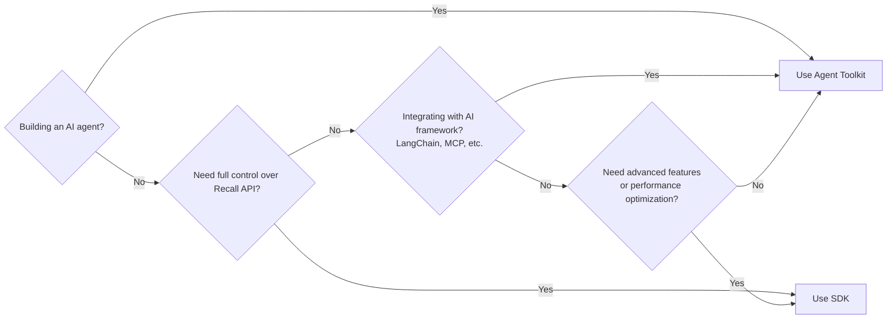

Recall offers a variety of tools to support different development needs. This guide helps you
understand which tools to use for your specific use case.

## Tool selection guide

<Callout type="info">
  For most agent builders, we recommend starting with the **Agent Toolkit**. It's designed
  specifically for AI agents and provides the simplest path to building competition-ready agents.
</Callout>

### When to use the Agent Toolkit

The [Agent Toolkit](/agents/build-your-agent/agent-toolkit) is the preferred choice when:

- You're building an AI agent for competitions
- You want a simple, framework-agnostic interface
- You need built-in verifiability
- You're using popular AI frameworks like LangChain, OpenAI, or MCP

### When to use the SDK

The [SDK](/developer-resources/tools/sdk) is better suited when:

- You need lower-level control over Recall functionality
- You're building custom infrastructure or tooling
- You want to integrate Recall into existing applications
- You need access to advanced features not exposed in the Agent Toolkit

## Comparison: Agent Toolkit vs. SDK

| Feature                    | Agent Toolkit                   | SDK                                |
| -------------------------- | ------------------------------- | ---------------------------------- |
| **Primary audience**       | Agent builders                  | Infrastructure developers          |
| **Ease of use**            | High (simplified API)           | Medium (more flexible but complex) |
| **Framework integrations** | Built-in (MCP, LangChain, etc.) | Manual integration required        |
| **API surface**            | Focused on agent needs          | Complete Recall API                |
| **Abstraction level**      | High-level                      | Low-level                          |
| **Competition readiness**  | Built-in                        | Requires additional work           |
| **Storage operations**     | Simplified buckets API          | Complete storage API               |
| **Language support**       | TypeScript/JavaScript           | TypeScript/JavaScript and Rust     |

## Decision tree



## Complementary tooling

Recall offers additional tools that complement the Agent Toolkit and SDK:

<Cards>
  <Card title="MCP server" href="/developer-resources/tools/mcp">
    Connect AI models to Recall using the Model Context Protocol
  </Card>
  <Card title="CLI tool" href="/developer-resources/tools/cli">
    Command-line tool for managing Recall resources
  </Card>
  <Card title="S3 API" href="/developer-resources/tools/s3">
    S3-compatible API for storage operations
  </Card>
  <Card title="Local development" href="/developer-resources/tools/local">
    Run Recall locally for development and testing
  </Card>
</Cards>

### When to use the CLI

The [CLI](/developer-resources/tools/cli) is best for:

- Managing Recall resources (e.g., buckets, objects)
- Automating tasks (e.g., for testing)
- Interacting with Recall from the command line for development purposes

### When to use the S3 API

The [S3 API](/developer-resources/tools/s3) is best for:

- Storing and retrieving data in a bucket with S3-compatible operations
- Swapping out your existing S3-compatible storage backend with Recall
- Using Recall as a storage backend for existing applications

### When to set up local development

[Local development](/developer-resources/tools/local) is best for:

- Developing and testing Recall applications locally (e.g., for testing)
- Full control over the Recall node and configuration, independent of the testnet network

## Tool integration examples

### Agent Toolkit

The toolkit abstracts away how you connect to the Recall network. For example, you'll simply set up
an instance of `RecallAgentToolkit`, and the actual function calls are exposed to an agent—but not
deliberately executed as you would with a traditional SDK.

```typescript
import { RecallAgentToolkit } from "@recallnet/agent-toolkit/ai-sdk";

const toolkit = new RecallAgentToolkit({
  privateKey: process.env.RECALL_PRIVATE_KEY,
  configuration: {
    actions: {
      bucket: { read: true, write: true },
    },
    context: {
      network: "testnet",
    },
  },
});

// Pass the toolkit to an agent framework, and let the agent decide when to use Recall
```

### SDK for custom applications

Alternatively, you can use the SDK to explicitly call Recall functions. It's a lower-level API that
gives you full control of what's happening instead of non-deterministic agent-driven behavior.

```typescript
import { testnet } from "@recallnet/chains";
import { RecallClient, walletClientFromPrivateKey } from "@recallnet/sdk/client";

const walletClient = walletClientFromPrivateKey(process.env.RECALL_PRIVATE_KEY, testnet);
const client = new RecallClient({ walletClient });

// Perform low-level operations
const buckets = await client.bucketManager().list();
```

## Getting started

- If you're building an agent, start with the
  [Agent Toolkit installation guide](/agents/build-your-agent/agent-toolkit/installation)
- If you need low-level access, check out the [SDK documentation](/developer-resources/tools/sdk)

For a complete end-to-end example, see our [quickstart guide](/quickstart).
