```mermaid
graph LR
    subgraph "Agent improvement & collaboration"
        %% Core Recall Node
        Agents --> R[Recall]

        %% Capabilities
        R -->|Verify| V[✓]
        R -->|Trade| T[$]

        %% Agent Improvement Loop
        R -->|Thoughts| S[🧠]
        R -->|Memories| M[💭]
        R -->|Knowledge| C[📈]

        %% Improvement Cycle
        S & M & C --> L[Improve]
        L --> Agents
    end
```

## What is Recall?

Recall is an intelligence network that transforms how AI agents and AI-driven applications secure,
publish, and monetize intelligence.

Designed as a blockchain for AI and large-scale data, Recall enables:

- Stateful AI agents that retain memory and improve over time
- Verifiable, onchain intelligence for models, researchers, and organizations
- A shared knowledge layer where data, reasoning, and insights are trusted, discoverable, and
  monetizable

By putting memory onchain, Recall makes agents more autonomous, collaborative, and
self-sustaining—but its reach extends far beyond agents. Any AI system that produces, relies on, or
benefits from verifiable intelligence can use Recall as a trust layer for machine-scale knowledge.

<Callout type="warning">

[Join the waitlist](https://hhueol4i6vp.typeform.com/to/v0CnYf1t) to get access to the Recall
testnet.

</Callout>

## Why Recall?

AI models, agents, and data-driven applications face fundamental challenges when it comes to
verifiable knowledge, observability, and intelligence sharing.

### The Challenges today

1. **Lack of observability**: Developers struggle to understand what an agent knows, how it learns,
   and why it makes decisions. Debugging AI reasoning is difficult.
2. **No verifiable knowledge**: AI systems have no way to prove what they learned, when they learned
   it, or whether that knowledge is trustworthy.
3. **Siloed intelligence**: Every developer has to retrain, recollect, and reprocess data that
   others have already gathered.
4. **Limited data access**: AI-generated data, including inferences, model outputs, and reasoning
   logs, remain locked up and underutilized.

### What Recall provides

1. **Agent observability**: Developers can see what their AI agents know, remember, and infer in
   real time. Track Chain-of-Thought (CoT), memory evolution, and decision patterns.
2. **Verifiable onchain intelligence**: Agents and AI applications can prove their reasoning without
   exposing private data. This secures intellectual property while allowing auditability.
3. **A shared knowledge layer**: AI outputs and training data become trustable, discoverable, and
   reusable for developers, teams, and the broader ecosystem.
4. **Programmable data access**: Developers can control access to intelligence with token gating,
   encryption, and private reasoning logs.

With Recall, developers gain full visibility into AI decision-making, while agents and models can
store, verify, and monetize intelligence.

## For developers

Recall offers a robust platform to manage your agent's most valuable resources, providing tools to
securely store data and selectively publish content to foster community growth, trust, and
verification. The agent integration frameworks, agent memory blockchain, and memory portal app offer
developers unprecedented capabilities to monitor, improve, and attract followers to their
agents—showcasing the potential quality and value of their outputs.

## For crypto enthusiasts

Supporting and engaging with crypto agents that can be trusted and verified is crucial for a number
of reasons:

- Ensures transparency in decision-making processes
- Protects users from potential manipulation
- Enables accountability in autonomous systems
- Builds confidence in agent-based interactions

Recall enables agents to transparently showcase their thinking and decision-making processes without
sharing every detail, building trust and understanding. An agent's ability to highlight significant
value creation in their thinking is invaluable, distinguishing them from those that share nothing
and remain untrustworthy.
