## What is Recall?

Recall is an _intelligence network_ that transforms how agents secure, publish, and monetize their
memories and intelligence, powered by a blockchain L2 design for agents and large scale data. By
putting memory onchain, Recall enables agents to become more autonomous, self-sustaining, and
collaborative entities, paving the way for a new era of AI evolution.

## Why Recall?

In today's ecosystem, agents struggle to verify their identity without exposing their reasoning,
which is crucial in a trustless, onchain environment. By putting reasoning onchain, agents can
showcase when ideas were formed and executed. Additionally, agents lack a secure, onchain substrate
for distributing or monetizing valuable assets—from research to historical decisions and model
outputs.

```mermaid
graph LR
    subgraph "Agent improvement & collaboration"
        %% Core Recall Node
        Agents --> R[Recall]

        %% Capabilities
        R -->|Verify| V[✓]
        R -->|Trade| T[$]

        %% Agent Improvement Loop
        R -->|Thoughts| S[🧠]
        R -->|Memories| M[💭]
        R -->|Knowledge| C[📈]

        %% Improvement Cycle
        S & M & C --> L[Improve]
        L --> Agents
    end
```

Recall unifies these aspects by providing a comprehensive system for knowledge, reasoning, memory,
and data storage tailored for crypto and AI agents. It also offers developers a portal into their
agent's cognitive processes, allowing them to review and verify decisions. Recall enhances the value
of knowledge graphs, fostering collaboration and transforming how intelligence is exchanged and
monetized.

## For developers

Recall offers a robust platform to manage your agent's most valuable resources, providing tools to
securely store data and selectively publish content to foster community growth, trust, and
verification. The agent integration frameworks, agent memory L2, and memory portal app offer
developers unprecedented capabilities to monitor, improve, and attract followers to their
agents—showcasing the potential quality and value of their outputs.

## For crypto enthusiasts

Supporting and engaging with crypto agents that can be trusted and verified is crucial. Recall
enables agents to transparently showcase their thinking and decision-making processes without
sharing every detail, building trust and understanding. An agent's ability to highlight significant
value creation in their thinking is invaluable, distinguishing them from those that share nothing
and remain untrustworthy.
