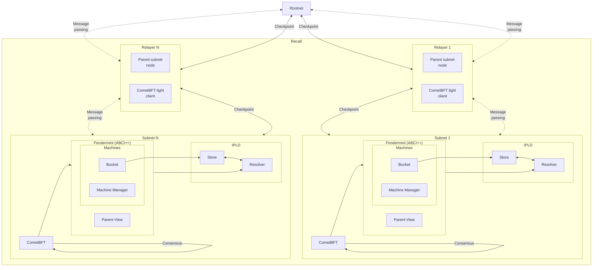

Recall is a decentralized at data network optimized for data-intensive applications. It exposes a
unified data layer backed by a consensus-driven network of actors supporting a fully decentralized,
permissionless, and ownerless architecture. The consensus layer itself is purpose-built to address
the needs of modern data-hungry applications and services, and this design enables a number of
additional innovations, including Recall's _synchronous data synchronization_ mechanism, allowing
the network to ingest large data and files while safeguarding chain liveness.

## Hierarchical structure

The hierarchical nature of Recall also allows it to naturally and logically shard data across
multiple subnets, enabling the network to scale horizontally as demand grows. Additionally, the
arrangement of data and services within unique subnets provides the key substrate upon which
additional innovations can be added.

Recall's decentralized network is developed using the
[Filecoin InterPlanetary Consensus (IPC) framework](https://docs.ipc.space/). IPC is a blockchain
scaling solution and architectural design that is an alternative to existing
[L2 scaling solutions](https://l2beat.com/) and based on the design principles of on-demand
horizontal scaling (similar to traditional web applications).

## Subnet scaling

Traditional blockchains often struggle with scalability as data volume and user base increase, and
Recall tackles this by employing a _subnet_ architecture. This enables parallel processing across
numerous blockchains (subnets), significantly improving throughput.

IPC is designed to enhance performance, decentralization, and security for decentralized
applications by allowing permissionless creation of new blockchain subsystems called subnets. These
subnets are organized hierarchically, enabling seamless internal communication and reducing reliance
on cross-chain bridges, while each can employ its specific consensus algorithm and inherit security
from parent subnets. This structure facilitates hosting or sharding applications based on
performance or cost needs.

Each subnet is associated with exactly one parent. One parent can have many child subnets associated
with it, forming a tree structure. Child subnets periodically checkpoint information to their parent
subnet, and these checkpoints are propagated recursively to the rootnet. This ensures that child
subnets benefit from the security of their parents. Checkpoints cannot be reverted, even if trust is
violated in a child subnet, as long as the parent continues to operate as expected.

Operators of a subnet run a full validator node for both the parent and the child subnet. Requiring
the nodes of child subnets to run the nodes of parents is a security parameter to ensure
checkpointed states of the subnet are appropriately stored, at the right time in the parent. In the
future, Recall subnets will also be able to dynamically adjust their capacity by spawning temporary
subnets during peak usage and merging them during lower activity.
