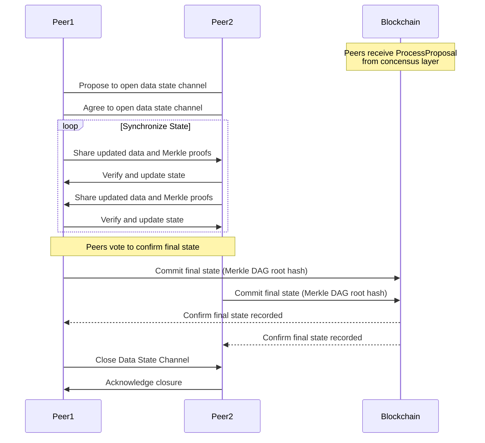
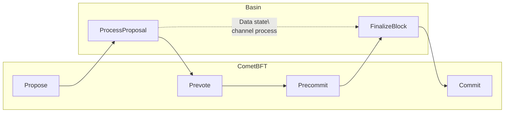

import { Callout } from "nextra/components";

Consistency in [distributed systems is a complex topic](https://docsend.com/view/gu3ywqi), and Hoku
is no exception. The network is designed to be highly available and partition tolerant, which means
that the network is able to continue operating even in the event of network disruptions or other
failures. This is achieved largely by leveraging the IPC hierarchical consensus protocol and makes
Hoku robust to network disruptions and faults.

## Data state channels

Eventual consistency allows subnets to "diverge" temporarily, but eventually arrive back to the same
state. For example, if a parent subnet stops being available, other subnets on the network can
continue to work, albeit disconnected from the rest of the hierarchy until the parent subnet becomes
available. This provides availability and partition tolerance by trading consistency (in the event
of a disruption) for eventual consistency.

As an active area of research, designing real systems with
[provable eventual consistency](https://hal.inria.fr/inria-00555588) guarantees
[remains challenging](https://arxiv.org/abs/1603.01529), however the Hoku system strikes a balance
between
[consistency, availability, and partition tolerance](http://pld.cs.luc.edu/courses/353/spr11/notes/brewer_keynote.pdf)
(see [Brewer's conjecture](https://dl.acm.org/doi/abs/10.1145/564585.564601)) by leveraging
peer-base consensus and hierarchical checkpoints to arrive at strong eventual consistency. Another
important aspect of Hoku’s consistency model is the use of _data state channels_, which allows the
chain to remain "live", while members of a subnet synchronize over correct state in the background.

State channels have emerged as a promising solution to the scalability issues of blockchains. By
allowing transactions to occur offchain and only recording the final state onchain, state channels
can significantly reduce the load on the main blockchain. However, standard state channels are
primarily designed for financial transactions and do not cater well to scenarios involving the
synchronization of large, complex data sets, such as Merklized directed acyclic graphs (DAGs) or
other verifiable data structures as employed in Hoku.

To address these limitations, we introduce the concept of _data state channels_. Unlike traditional
state channels, data state channels are ephemeral and specifically designed to facilitate the
synchronization of state among a group of peers. Once all parties agree on the final commitment, the
state is then committed onchain. This approach is particularly useful for applications requiring
collaborative data synchronization and verification, such as collaborative platforms, or in our
particular base, decentralized storage solutions.

## Data synchronization

State channels are a well-established Layer 2 scaling solution for blockchains. The fundamental idea
is to enable two or more parties to conduct multiple transactions offchain and only record the
initial and final states onchain. This significantly reduces the number of transactions that need to
be processed by the blockchain, thereby improving scalability and reducing transaction fees. Notable
examples include Bitcoin's Lightning network, and Ethereum's Raiden network.

Outside of blockchains, data synchronization is a common problem in distributed systems. In
decentralized storage systems, for example, multiple nodes need to synchronize their data to ensure
consistency and reliability. Data synchronization in these types of systems often relies on
structures like Merkle trees and DAGs. These structures allow for efficient verification of data
integrity without requiring the entire data set to be transferred or stored. Merkle DAGs, in
particular, are used in various decentralized applications to ensure that data can be verified and
synchronized efficiently across multiple nodes.

By combining features of traditional state channels with tools for synchronizing authenticated data
structures, data state channels offer several advantages over other data synchronization mechanisms.
For example, unlike standard state channels, which are primarily designed for financial
transactions, Data State Channels are ephemeral and specifically geared toward synchronizing complex
data sets. They support structures like Merkle DAGs, making them suitable for applications involving
large and verifiable data. Furthermore, Data State Channels ensure that all parties reach consensus
on the final state before committing it onchain, enhancing reliability and trust in the system.

The temporary nature of data state channels allows for quick and efficient state synchronization
without the need for long-term channel maintenance. Such channels are ideal for scenarios where
state synchronization is needed for short-term tasks. For example, in collaborative editing,
multiple users can simultaneously edit a document, synchronize their changes, and commit the final
version onchain once consensus is reached. Similarly, in decentralized storage, peers can
synchronize and verify large data sets before committing the verified state onchain.

### Synchronization process

The synchronization process in data state channels involves several key steps. Initially, a data
state channel is established by the participating peers, who agree to open the channel and lock any
necessary resources or funds on the blockchain. Peers then exchange data offchain, continuously
updating the state of the channel. Each update is verified using cryptographic proofs to ensure data
integrity. The process involves peers sharing hashes of the updated data along with the necessary
Merkle proofs to verify the changes.

As data is exchanged, each peer verifies the received updates by checking the Merkle proofs against
their own copy of the data structure. This ongoing verification ensures that all peers maintain a
consistent view of the state. Once all updates are verified and consensus is reached, the
agreed-upon state is then committed to the blockchain by recording the final root hash.

<Callout>

The specifics of the onchain commitment process may vary depending on the application and use case.
For example, in Hoku the final state is committed to the blockchain by recording the final root hash
in the state of the target machine.

</Callout>

## End-to-end flow

In Hoku, data references are represented as CIDs onchain (within a machine’s state). In most cases,
the actual data is stored _offchain_, in a node's local (networked) blockstore. The actual storage
layout etc is an implementation detail of the Hoku node, though in practice, this currently uses an
IPFS-style blockstore. During normal chain operation, nodes are instructed to fetch object data as
part of the normal consensus process. However, the default CometBFT consensus process has no builtin
mechanism to ensure that all validators (or a quorum) has actually downloaded the data before the
data is referenced (by CID) onchain.

To address this, Hoku leverages data state channels, and the concept of a _detached payload_. A
detached payload is a transaction that includes a CID reference to some data, but does not include
the data itself. When a detached payload is added to the chain, validators leverage a data state
channel to synchronize the data and verify that it matches the CID reference. This ensures that all
validators have a copy of the data locally, and can verify the integrity of the machine state.

When a client submits a detached payload transaction, this kicks off a background process on each
validator in which they attempt to open and/or join a data state channel specifically designed to
synchronize that object data (see figure for a general overview of data state channel operations).
As far as the client/transaction is concerned, they are simply submitting a transaction. The normal
transaction flow is unaware (and unencumbered) by the asynchronous data exchange happening in the
background.

Validators leverage a _channel pool_ for managing pending data state channel sync. Data resolution
runs in the background, so as not to block items from other subnets being tried. In practice, the
data resolution process takes resolution tasks from the resolution pool and uses the IPLD resolver
to fetch the content from the local node's networking layer.

<Callout>

At the moment, the data resolution process is a simple IPFS-based process which interfaces with the
IPLD resolver (which itself leverages the
[Bitswap protocol](https://docs.ipfs.tech/concepts/bitswap/)) to fetch the content from a local IPFS
node. In the future, this process will optimized to be more efficient and scalable.

</Callout>

Once a validator has the data locally (via synchronization with its peers), the validator issues a
_vote_ to the other validators to confirm data synchronization and availability (this is similar to
Ethereum's concept of a
[data availability committee](https://ethereum.org/en/developers/docs/data-availability/#data-availability-committees)).
During this time, normal block production continues.

<Callout>

This vote-based mechanism rides on the existing voting machinery used by the core IPC process for
top-down parent finality. As such, it requires the top-down finality handling to be enabled in order
to determine if validators have enough power to vote, and to know how to calculate quorum, based on
said power.

</Callout>

During the block proposal process, validators always collect _locally_ resolved objects from their
local data state channel pool. In this sense, we rely on the proposer's local view of object
resolution, rather than considering those that _might_ have a quorum, but have not yet been resolved
by _this_ proposer (hence, eventual consistency). However, we maintain _strong_ eventual
consistency, because an object in this state this will be picked up by a different proposer who
_does_ consider it resolved in a future block/cycle.

The leader of a given consensus round checks the vote tally for quorum (in practice, the block
producer must also check onchain state for "resolved" as well as the in-memory vote tally), based on
the power table (stake) within the subnet. If a quorum is reached, the leader injects an _implicit
transaction_ into the proposal, which is validated by the other validators based on their view of
the vote tally. Finally, during execution of this transaction, the object is marked as "resolved".
Querying the bucket at this point will show resolved status. The whole process is asynchronous, and
the object is not considered resolved until the next block. See figure for a high-level overview of
the block production process in Hoku based on the CometBFT ABCI++ framework.

<Callout>

Implicit transactions are specialized FVM transactions which in theory may come from any data
contract, ignore the transaction nonce, and charge no gas (but still account for it). Conversely,
normal (explicit) transactions may only come from accounts and charge the sending account for gas
consumed.

</Callout>
