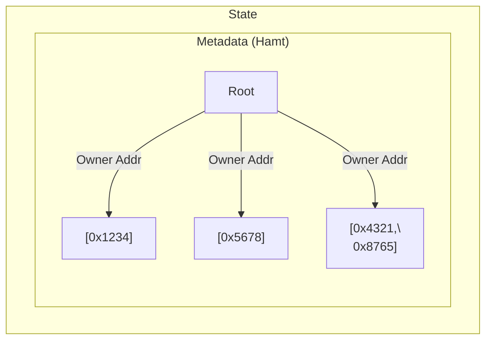
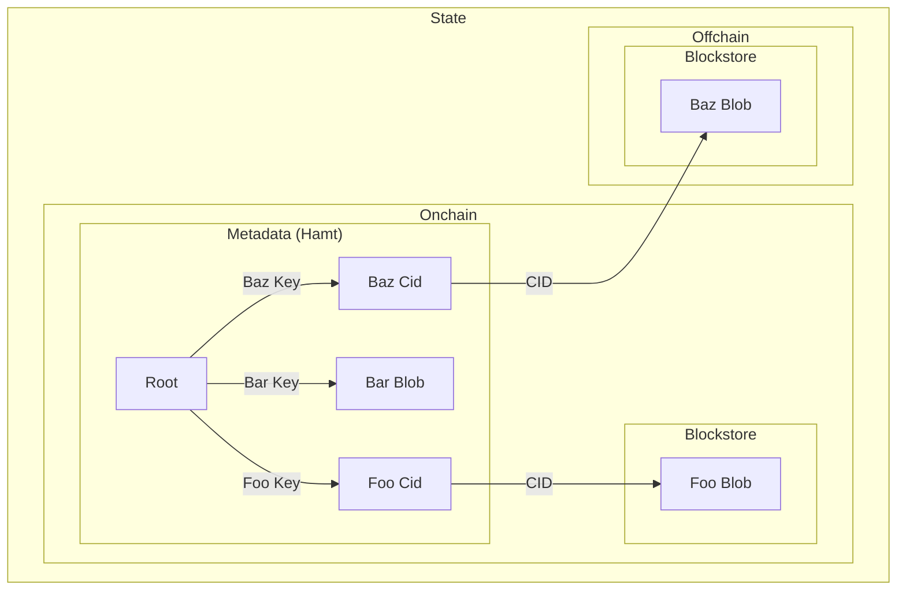

import { Callout } from "nextra/components";

Hoku’s core functionality is built on top of the FVM as a series of _Wasm contracts_, which are,
essentially, Wasm-based smart contracts that run on the FVM and are used to manage, query, and
update the state of the subnet. In effect, the FVM is responsible for executing the logic of the
Hoku protocol.

## Contract execution

The FVM executes messages in [Wasm](https://webassembly.org/) over actor state and uses the
[Wasmtime runtime](https://wasmtime.dev/). This includes a Wasm implementation of the
[EVM bytecode](https://ethereum.github.io/yellowpaper/paper.pdf) interpreter. Under the hood, any
"built-in" FVM and "custom" (subnet-specific) Wasm contracts are compiled to CAR files and provided
to the subnet during genesis.

<Callout>
For further details on the FVM, see the [Filecoin documentation](https://docs.filecoin.io/smart-contracts/fundamentals/the-fvm).

</Callout>

Within Hoku, our default contracts are called **_Wasm contracts_**. These are the core building
blocks of Hoku; each Wasm contract has its own unique address and is associated with a unique owner
address. This helps track which contracts are tied to a given account. At present, Hoku ships with
three core Wasm contracts: the _address manager_, _bucket_, and _timehub_. These contracts are
responsible for managing the state of a subnet, creating new buckets, timehubs, and storing and
retrieving data from the subnet.

One of the main advantages of the FVM runtime is its support for [IPLD](https://ipld.io/), a
hash-linked data model that can be used to represent and traverse hash-linked data. It's the basis
for those familiar with IPFS. All onchain data is represented as IPLD, which is stored in the state
tree of the subnet. Notably, this means you can create Wasm contracts that _use_ IPLD (e.g., Rust's
[libipld](https://github.com/ipld/libipld) crate).

## Data vs. smart contracts

Subnets use the FVM Wasm runtime because it offers flexible and data-oriented programmatic control.
The FVM is simply an IPLD-friendly virtual machine that supports Wasm actors and other handy
features.

This flexibility enables the creation of both smart contract and Wasm contracts, the latter of which
allows developers to write programs in languages like Rust, significantly broadening the range of
services and products that can be built. Since the runtime maintains full EVM compatibility,
traditional smart contracts can also be written in Solidity. This dual capability ensures that
developers can leverage the best tools for their specific needs.

## Wasm contracts

Hoku comes with a few built-in Wasm contracts that are used to manage the state of the subnet and
implement core data structures.

### Address manager

Clients are able to deploy new object stores on demand using the singleton address manager. The
primary function of the address manager is to create other _Wasm contracts_ and assign them a unique
address. Each Wasm contract is associated with a unique address (which is used to identify the store
on the network), and an owner address.

### Object store

Object stores are deployed as instances of the object store Wasm contract. This contract is
responsible for managing the state of the object store itself, including creating, updating, and
deleting keys/objects. Each object store manages its own metadata state, which is stored on the
network and can be accessed by other contracts. The object store contract provides a set of methods
for interacting with the store, including `add`, `get`, `query`, and `delete`, which allow clients
to store and retrieve data from the object store.

These are key-value stores that allow you to push and retrieve data in a familiar S3-like fashion.
Object stores also support byte range requests and advanced queries based on key prefix, delimiter,
offset, and limit.

Internally, the state of an object store is represented as an
[IPLD-based HAMT](https://ipld.io/specs/advanced-data-layouts/hamt/spec/)
([hash array mapped trie](https://en.wikipedia.org/wiki/Hash_array_mapped_trie)). The IPLD data
model provides a flexible and extensible way to represent complex data structures, and the
[invariants and mutation rules](https://michael.steindorfer.name/publications/oopsla15.pdf) enforced
by the IPLD HAMT provides us with the ability to maintain canonical forms given any set of keys and
their values, regardless of insertion order and intermediate data insertion and deletion. Therefore,
for any given set of keys and their values, we get a consistent object store configuration, such
that the root node will always produce the same CID.

<Callout>

The root commitments (a CID) of the HAMT provide the cryptographic hash required for onchain proof
verification.

</Callout>

The HAMT itself references the blobs of the object store, which may be included directly (for
smaller payloads that fit entirely within a single transaction), or as part of a _detached payload_.
When required, Hoku can leverage the IPLD resolver (and store) to read and write data to its
internal state, so that it is IPLD addressable.
