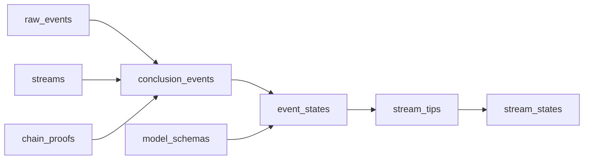

import { Callout } from "nextra/components";

# Concepts

Ceramic combines a powerful event streaming platform with the open access and verifiability of the
modern, decentralized web. This page provides a brief overview of the core architecture, with a
focus on how the high-level components of the protocol fit together.

You may find this page helpful even if you are working with a database or other application built on
top of the core protocol, such as OrbisDB, although there may be some details here that are less
relevant to your needs, and some things that are better covered by the documentation of the tool
you're interacting with directly.

## Event Streaming

### Events

Events are atomic units of information, captured at a point in time and propagated throughout the
Ceramic network. Events are organized into [streams](#streams), which group related events into a
sequence and provide a [consistent ordering](#consistent-ordering) that all [consumers](#consumers)
can agree upon and validate.

Events include a `data` payload, which is a sequence of bytes whose structure and semantics are
determined by applications building on the Ceramic protocol.

Once an event is published, it is _immutable_ and cannot be altered or deleted. However, by
leveraging the [data pipeline](#data-pipeline) of an event stream, applications can create mutable
data structures out of a sequence of immutable events. At present, the primary style of events
written to streams are JSON-patch updates, making it possible to represent mutable records as the
aggregation of immutable patches to an initial record state.

### Streams

An event stream contains an ordered sequence of [events](#events). Streams are created by publishing
an "init event," which contains the identifiers of the [producers](#producers) who are authorized to
write “data events” into the stream.

The [content identifier (CID)](https://docs.ipfs.tech/concepts/content-addressing/) of the init
event is used as part of the `StreamId`, which uniquely identifies each stream in Ceramic.

Events published into a stream contain a hash-link to prior events, allowing the full event history
to be verified for integrity and authenticity.

### Interests

Event consumers can declare “interests” in a selection of the events in the global Ceramic network.
This allows consumers to receive the events that they care about, without being overwhelmed by event
streams that are irrelevant to their application. You can think of an interest as a filter on the
“fire hose” of events flowing through the Ceramic network.

Interests allow Ceramic nodes to efficiently exchange events across the network while optimizing for
delivery to active consumers. As nodes synchronize with each other, they can prioritize events
within their respective “interest ranges.”

Interests may describe a data model that an application is concerned with (e.g. activity telemetry
from an online forum), a user identifier whose data an application wants to persist (e.g. the posts
and interactions of a single user on a forum), or more abstract qualities (e.g. all posts within a
certain subforum).

### Producers

Ceramic is an open network, where anyone can submit events into streams that they control. Ceramic
nodes cooperate to distribute events to all interested consumers, while also validating that events
have a valid signature from one of the authorized producers declared when the stream was created.

An event producer is identified by a DID, or decentralized identity document. A DID contains either
a public cryptographic key, or enough information to retrieve and verify a public key from an
authoritative source.

DIDs serve a similar purpose as “accounts” in most centralized systems, with the distinction that
they are controlled directly by the creator of the identity and are not issued by a central
authority. This allows great flexibility, and it ensures that your identity can be used with many
complementary systems without being tied to any one of them.

Ceramic uses the
[PKH standard](https://github.com/w3c-ccg/did-pkh/blob/main/did-pkh-method-draft.md) DID method,
which allows blockchain accounts to sign, authorize, and authenticate Ceramic messages and events.
Ceramic also supports the [did:key](https://w3c-ccg.github.io/did-method-key/) method which lets
users directly sign messages with a public key.

### Consumers

Ceramic nodes are continuously synchronizing with one another, distributing messages throughout the
network and updating their local state as new events come in. When consumers register an
[interest](#interests) in a selection of events, those events are prioritized and delivered to the
consuming application.

Applications building on Ceramic can subscribe to event streams and react to events as they arrive.
Consumers can either handle the event `data` payloads directly using their own bespoke processing,
or they can leverage Ceramic's standard data pipeline to combine messages into new forms, including
mutable data structures and other key components of a modern data environment.

## Archival Storage on Recall

The Ceramic Network in the context of Recall is a communication, synchronization, and validation for
ephemeral events. While this architecture is intentionally flexible to allow for bespoke molding of
custom data pipelines, schema, and other logic, it requires a data availability layer to provide
archival assurances and programmatic access.

To accommodate this need, Ceramic events are aggregated into parquet files as they undergo
transformations across the Ceramic data pipeline, giving developers access to raw events, resolved
document states, or custom document states based on bespoke logic developers implement into their
pipelines.

These parquet files containing Ceramic events are stored in Recall buckets. The columnar storage
format of parquet files is highly efficient for analytical queries, therefore reducing data transfer
and storage costs. Parquet also supports performant compression schemes which reduces file sizes
further without compromising performance.

## Data Pipeline

The pipeline architecture processes Ceramic data through a series of transformations that define
features and enable diverse functionalities. Data enters the system via its API and is first stored
in the raw_events table. It then undergoes sequential transformations that generate intermediate
tables, each designed to organize and enrich the data. These tables, with schemas treated as public
APIs, provide structured access and support specific query patterns for interacting with the data
using Flight SQL.

<Callout>
  Ceramic currently exposes `event_states` and `conclusion_events` as exposed tables available for
  developers to query. All other pipeline tables are in development.
</Callout>

### raw_events

The raw_events table contains the raw event data from Ceramic streams, including the corresponding
CAR files. This table enables direct interaction with event data for validation and further
processing.

### streams

The streams table provides identifying information for each stream, such as its type, controller,
and dimensions. It serves as a central reference for understanding and querying stream metadata.

### time_conclusions

The time_conclusions table contains a row for each conclusion about a CID existing on chain.

### conclusion_events

The conclusion_events table holds transformed event data with resolved dimensions, controller
information, and validated signatures, facilitating pre-aggregated queries and stream ordering.

### model_schemas

The model_schemas table contains fully resolved schemas for models, supporting schema validation and
providing a reference for stream structure. (Further schema and population details are TBD.)

### event_states

The event_states table tracks the document state at each event within a stream, providing access to
the complete history and enabling validation against model schemas.

### stream_tips

The stream_tips table identifies the current tips of streams, representing the latest unresolved
states for developers working on conflict resolution systems.

### stream_states

The stream_states table provides the canonical state for each stream after applying conflict
resolution, offering a reliable snapshot of stream data for consumers.

_For a more detailed breakdown of each table, please visit the
[Pipeline Architecture](https://github.com/ceramicnetwork/rust-ceramic/blob/main/pipeline/DESIGN.md)
overview._

### Models & Documents

While events are a powerful and flexible basis for a data platform, they aren't always a perfect fit
for “application level” data modeling. Using the aggregation framework, events can be combined to
form structured documents that can evolve over time.

Documents are conceptually just JSON objects. The initial state of the document is included in the
“init event” of a Ceramic stream, and the `StreamId` is used to identify the document and listen for
future update events. Updates to documents take the form of events containing JSON patch objects
which encode an operation to perform on the current state, for example, set the field `"name"` to
the value `"Ada Lovelace"`.

Databases built on Ceramic like OrbisDB extend the idea of JSON-based documents and defines a shared
vocabulary of “models.” A model specifies the fields, data types, and relationships to other models
that are supported for a specific kind of data. For example, a simple social media post model might
include a text status field, a link to the author's account, and optional links to attached media
objects.

In Ceramic, models are associated with the model instance document stream type. Ceramic is, however,
designed with the flexibility to process events for various stream types, with models representing
just one stream category. Therefore, it is important to note that the data pipeline steps outlined
above will vary based on different stream types. While Ceramic currently only supports model and
model instance document streams, support for new stream types will be introduced by implementing
their pipeline aggregation steps in the near future.
