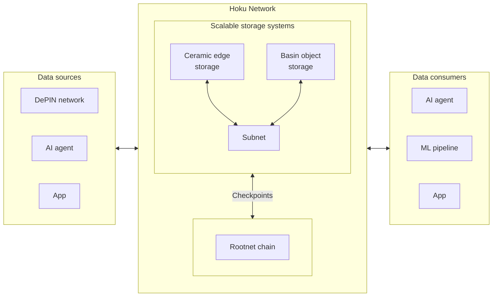

import { Cards, Card } from "nextra/components";

Hoku is a **decentralized cloud and data liquidity network** with the express goal of connecting those in need of data
services with those that wish to provide data services. It unifies best-in-class data solutions and datasets into a
single platform powered by a **scalable, permissionless, verifiable data blockchain**. This enables developers,
organizations, and machines to finally break through the _Data Wall_ to fully realize the vision for what they can do
with open data pipelines and workflows—designed for data-intensive and AI applications at scale.

The Hoku platform provides novel data availability (i.e., **_data overlay_**) purpose-built for large volumes of
heterogenous data, backing an ecosystem of data services:

- [**Basin**](/object-storage): Object store with an S3-compatible interface that is fully verifiable onchain.
- [**Ceramic**](/event-store): Event store for verifiable, private data through offchain nodes that synchronize + cache
  data.

Built on top of those core services are products (e.g., databases) that provide familiar interfaces for developers to
interact with the underlying network:

- [**OrbisDB**](/databases/orbisdb-introduction): SQL database (wrapper around Ceramic) for application developers, built on Postgres.
- [**Tableland**](/databases/tableland): Onchain decentralized SQL database for networks (e.g., DePINs), built on SQLite.

Over time, Hoku primitives will enable additional services and products to be openly created. That is, the data overlay
is a general purpose Data Availability layer that can make _any_ data network an availability network, effectively
expanding the storage and distribution capabilities of the underlying network.

## Why Hoku?

### The Data Wall

Innovation amongst data intensive applications is hitting a
[Data Wall](https://www.lesswrong.com/posts/axjb7tN9X2Mx4HzPz/the-data-wall-is-important). The amount of data being
generated is increasing rapidly, which should lead to a paradise for developers building data rich, personalized,
intelligent applications. Instead, organizations are facing an accelerating data deficit: their demand to utilize data
is growing far faster than their ability to access and take action on data.

The _Data Wall_ is a metaphor for the barriers that prevent data from being shared and used effectively:

1. **Siloed**: Data is locked up in proprietary formats and systems, making it difficult to access and use.
2. **Unmonetized**: Data is hard to find, share, and exchange, which makes it difficult to get or capitalize on data.
3. **Unverifiable**: Data is hard to audit, verify, or even out-of-date, leading to poor data quality and trust.
4. **Unrealized**: Data is hard to innovate, collaborate on, and share, leading to missed opportunities and benefits.

This impacts both data producers and consumers:

- **Data Providers**: Struggle to find cost-effective ways to store large amounts of data at scale, with open standards
  and credible neutrality, and the ability to connect and expose this data more easily.
- **Data Consumers**: Struggle to sourcing new, high-quality data necessary for new applications (e.g., AI, ML,
  analytics), and without the ability to trust and verify the data they are using.

In order to overcome the Data Wall, novel sources of data are required. For example, this could come from improved
access to siloed data, aggregation of fragmented data, or production of useful synthetic data. Today, these sources are
only available for hyperscaled organizations with massive data, infrastructure, and market power to bring to bear on
their own proprietary platforms and ecosystems.

While these data sources _do_ exist today, they are structurally disconnected from many consumers because of the limits
of traditional infrastructure. By giving these data sources a data platform more fit for modern requirements, we can
bring this novel data online and break down the data wall.

There is need for a unified solution to **store, source, and monetize data** at scale.

### The Collaborative Cloud

At a high level, you can think of Hoku as a decentralized _data overlay_ that connects data providers and consumers in a
secure and scalable manner:

- Provides **cost-efficient storage and fast distribution** of data.
- Drastically improves **data integrity and interoperability** with open formats and verifiable provenance.
- Enables **programmatic sharing, sourcing, and monetization** of data to fill consumer data needs continuously.
- Provides a foundation to foster an **ecosystem of compatible services** for critical workflows.

Data sources (e.g., aggregators such as DePIN networks) are provided with a scalable and cost-effective way to store
verifiable data sets. Developers interested in consuming and computing on that data (e.g., AI networks) can then plug
into the cloud to discover and gain access to these large datasets that were previously difficult to access. All of this
is facilitated and mediated on a single unified platform.

In contrast to current systems which are opaque, slow, cumbersome, and built on trust due to data centralization, Hoku
provides a novel approach to deliver more, higher quality data at lower cost than traditional cloud platforms can.

|                  | Traditional Cloud                                                                                                                                                                                                     | Hoku                                                                                                                                                                         |
| ---------------- | --------------------------------------------------------------------------------------------------------------------------------------------------------------------------------------------------------------------- | ---------------------------------------------------------------------------------------------------------------------------------------------------------------------------- |
| Storage          | Storage and compute is expensive, relying on huge data centers and scaled operations.                                                                                                                                 | Crowdsourcing resources and offsetting costs with monetization opportunities can dramatically lower the costs to store and generate data.                                    |
| Interoperability | Data quality, integrity, and interoperability are limited by non-standard and siloed systems, limiting the usability of data. It is difficult for multiple actors to participate in and manage shared data pipelines. | Data managed with open standards + cryptographic signatures + verifiable pipelines can be trusted and reused widely, both broadening the usefulness and amortizing the cost. |
| Monetization     | Monetizing data through current exchanges and marketplaces is clunky—a "weak" version of data exchange.                                                                                                               | Crypto-rails for data can enable much more dynamic and fluid exchange of data—the "strong" version of data exchanges—untapping huge value for data consumers and producers.  |
| Sourcing         | Users might find their own sources of data through traditional means.                                                                                                                                                 | Data sources are integrated directly into the Hoku network, enabling easy access to large scale data sets.                                                                   |

The Hoku blockchain orchestrates a set of validators to reach consensus on network state, stake, and more. In addition
to standard PoS blockchain mechanisms, Hoku incorporates several core components that make it uniquely suited to serve
as the base layer for an ecosystem of data services:

1. **Validator requirements**: Prioritizes decentralization to prevent any single point of failure. The network’s
   stability is bolstered by a carefully specified set of requirements for validators that emphasizes storage
   reliability over just about everything else.
2. **Scalability and performance**: Designed to handle a high throughput of transactions, making it suitable for
   data-intensive use cases. Hoku’s subnet architecture allows a context aware approach to sharding that improves data
   locality and minimizes cross-shard communication.
3. **Flexible architecture**: Built to support a wide range of data-oriented use cases, which may have quite varied
   requirements, and its subnet architecture allows each subnet to be purpose-built for specific use cases.
4. **Predictable pricing**: Emphasizes predictable costs for providers and consumers and lets them take advantage of
   better budget control and cost forecasting.
5. **Upgradeability**: Allows stakeholders to propose protocol upgrades and changes to help ensure the blockchain can
   evolve and adapt to new challenges and opportunities without requiring hard forks or disruptive transitions.
6. **Interoperability**: Supports interoperability with other blockchains and legacy systems, enabling seamless data and
   asset transfers across different platforms. This enhances the usability and reach of the Hoku network, fostering a
   more connected blockchain ecosystem.

## How does it work?

Hoku has been built from the ground up to meet the needs of modern data-hungry applications, ensuring high throughput,
low latency, and robust fault tolerance. The key to Hoku's design is its unique hierarchical "subnet" architecture and
layered consensus model, which allows it to scale to millions of users and billions of bytes. This subnet design is
purpose built for advanced onchain data storage patterns and use cases.

### Subnets & scaling

Hoku's data scaling pattern uses subnets, developed using the [IPC framework](https://docs.ipc.space) that exposes an
[FVM](https://fvm.filecoin.io/) (Wasm plus EVM) runtime, to provide a horizontally scalable, verifiable, and
cost-effective data overlay layer. This enables an on-demand horizontal scaling system, similar to scaling more
"traditional" (Web 2.0) applications.

### Contracts

Every subnet has access to EVM-like smart contracts (e.g., written in Solidity) and Wasm-based "data contracts"
(compiled to Wasm) that allow for low-level programmatic data access and manipulation. For example, Basin (object
storage) is implemented as a data contract (written in Rust) that can be deployed on a subnet by anyone, granting them
key-value storage capabilities.

### Transactions & storage

Like any blockchain system, transactions are used to interact with the network and are used to store and retrieve data.
These transactions are data-carrying payloads that get submitted to the network and processed by a consensus algorithm
before settling onchain. When you store data on Hoku, it gets packaged up into a compact Content Identifier (CID)
representation and submitted within the transaction as a _detached payload_. The transaction's CID is a _reference_ to
some data, but it does not _include_ the data itself since the data is stored fully offchain.

All transactions are signed by an account, which uses the same cryptographic primitives as Ethereum-style EVM chains
(i.e., ECDSA, secp256k1) to ensure that the transaction is authentic and authorized. Accounts are used to track balances
and permissions, and are used to pay for transaction fees and storage costs.

### Data Availability

This system employs [Alpha Entanglement (AE) codes](https://arxiv.org/abs/1810.02974)—an efficient erasure coding scheme
designed specifically for distributed networks—to encode data fragments into a robust and **tamperproof data mesh**.
These codes enable efficient data recovery, reduced storage costs, decentralized repair, and data integrity, as well as
the ability to tie information about the **data recency and retention requirements**
([TTL](https://en.wikipedia.org/wiki/Time_to_live)) into the way the data is encoded.

## Further learning

Hopefully, this introduction provided enough detail to get you started! To learn more about its features, detailed
architecture, or start building, check out the resources below:

<Cards>
  <Card title="Features" href="/home/features" />
  <Card title="Architecture" href="/architecture" />
  <Card title="Object storage" href="/object-storage" />
  <Card title="Event store" href="/event-store" />
  <Card title="Databases" href="/databases" />
</Cards>
